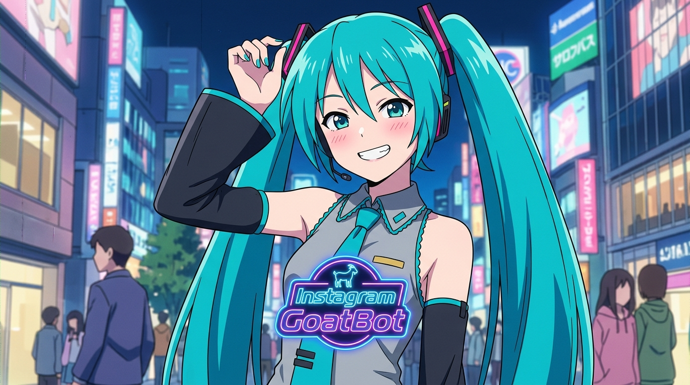
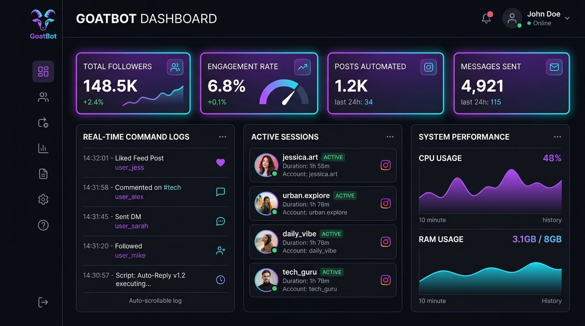
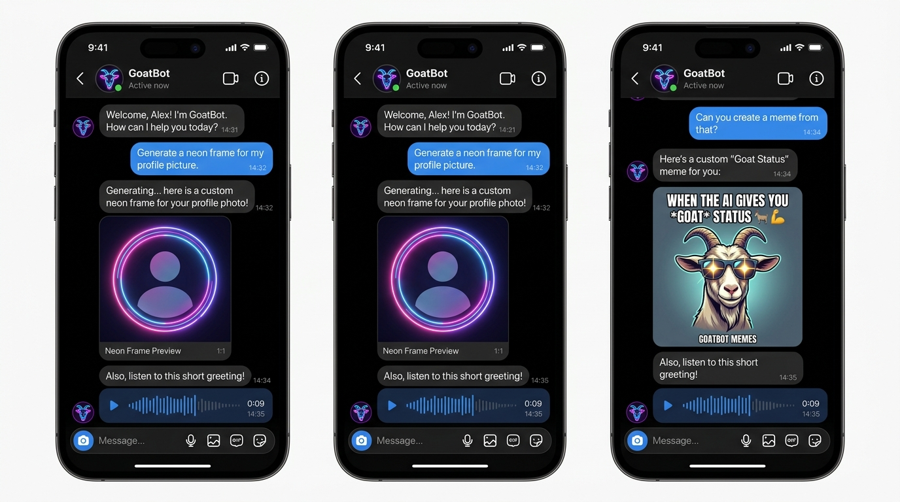

<div align="center">
  

  # 🐐 GoatBot Instagram Port (GoatBot-IG-Port)
  *Next-Generation High-Performance Instagram Chatbot Engine*

  [](https://nodejs.org/)
  [](https://github.com/Gtajisan/GoatBot-IG-Port)
  [](https://github.com/Gtajisan/GoatBot-IG-Port)
  [](#features)
  [](LICENSE)

  ---
</div>

## 🌟 Overview

**GoatBot-IG-Port** is a modular, high-performance Instagram Direct Messenger bot ported directly from the legendary **GoatBot V2** architecture. Built with a bundled native **Instagram Chat API (ICA)** engine, it supports full 1:1 event lifecycle compatibility, advanced anti-ban safeguards, Rose-bot style group administration, AI conversational memory, and media processing.

---

## 📸 Screenshots & Interface Showcase

<div align="center">
  <h3>🖥️ Web Analytics & Real-Time Management Dashboard</h3>
  

  <br/><br/>

  <h3>📱 Instagram Direct Messenger Interactive Commands Showcase</h3>
  
</div>

---

## 🔥 Key Features

### 🤖 1:1 GoatBot V2 Architecture
* **Full Event Lifecycle Hooks**: Complete support for `onStart`, `onReply`, `onReaction`, `onChat`, `onEvent`, `onFirstChat`, and `onLoad`.
* **Universal `message` Helper API**: Provides `message.reply`, `message.send`, `message.reaction`, `message.unsend`, `message.err`, and `message.SyntaxError`.
* **Dual Parameter Compatibility**: Flexible argument ordering handling both `(threadID, path)` and `(path, threadID)` for seamless command execution.

### 🛡️ Enterprise Anti-Ban & IP Shield
* **Adaptive Rate Limiter**: Learns dynamically from HTTP `429` responses (`Retry-After`) and enforces global request spacing.
* **Circuit Breaker Pattern**: Tripping protection isolates disrupted endpoints with a 30s cooling window.
* **Official Web Client Signatures**: Outgoing requests send authentic `Sec-CH-UA`, `Sec-Fetch-*`, `X-IG-App-ID: 936619743392459`, and `X-IG-WWW-Claim` headers.
* **Auto-Sync Cookie Persistence**: Automatically updates refreshed Netscape/JSON session cookies back to `account.txt` whenever updated by Instagram headers.

### 🧠 AI Auto-Talk & Behavioral Memory
* **Self-Training Engine**: Automatically learns conversation flows `(Message A → Message B)` from live group and DM chats.
* **Local Memory Database**: Instant zero-latency local lookup for learned phrase pairs.
* **Multi-Tier Open Source AI Failover**: 6-stage fallback pipeline using Pollinations AI, Popcat, and SimSimi.

### 🎙️ Voice & Audio System
* **Google TTS Voice Generation**: Convert text into natural voice notes (`!say <text>`).
* **Voice Note Broadcast**: Native support for sending `.mp3`, `.wav`, `.m4a`, and `.ogg` voice messages.

### 🌹 Rose Bot Group Management Suite
* **Keyword Auto-Responders (`!filter`)**: Add, list, and remove custom keyword triggers (`!filter <keyword> - <reply>`).
* **User Warning System (`!warn`)**: Issue user warnings with reason logging. Reaching **3/3 warnings** triggers an automatic group kick.

### 🎨 Media & Downloader Suite
* **Text-To-Picture Sticker Engine (`!ttp`)**: Generate custom stylized text graphics and stickers.
* **Native YouTube Downloader (`!sing`, `!video`)**: Built-in `yt-search` and `@distube/ytdl-core` stream engines for direct high-quality MP3/MP4 downloads.
* **AI Image Generation (`!imggen`)**: Powered by Pollinations AI for keyless image synthesis.

---

## 📁 Repository Structure

```
GoatBot-IG-Port/
├── assets/                  # Graphics and banner assets
│   └── banner.jpg
├── bot/                     # Core Bot Engine
│   ├── InstagramBot.js      # Main Instagram Bot Controller & FCA Wrapper
│   ├── autoUptime.js        # Server Uptime Keep-Alive Service
│   └── custom.js            # Custom Startup Scripts
├── commands/                # 83+ Modular Command Scripts
│   ├── ai.js, bby.js, say.js
│   ├── filter.js, warn.js, ttp.js
│   ├── sing.js, video.js, ytb.js, alldl.js
│   └── ...
├── config/                  # Bot Settings & Configuration
│   ├── default.json         # Safety, Rate Limits, and Bot Parameters
│   └── index.js
├── events/                  # Event Handlers
│   ├── message.js           # Incoming Message Handler & Auto-Talk
│   └── message_reaction.js  # Reaction Handler
├── lib/                     # Native ICA Scraper Library
│   └── ica/                 # NKXICA Scraper & Authentication Engine
├── utils/                   # Database & Helper Utilities
│   ├── database.js          # SQLite & JSON Storage Controller
│   ├── commandLoader.js     # Dynamic Command Loader
│   └── eventLoader.js       # Dynamic Event Loader
├── account.txt              # Exported Instagram Session Cookies
├── index.js                 # Entry Point
└── package.json
```

---

## 🚀 Quick Start & Installation

### 1. Prerequisites
* **Node.js**: v18.0.0 or higher
* **Git**: Installed and configured

### 2. Clone Repository
```bash
git clone https://github.com/Gtajisan/GoatBot-IG-Port.git
cd GoatBot-IG-Port
```

### 3. Install Dependencies
```bash
npm install
```

### 4. Setup Authentication Cookies
Export your Instagram session cookies (Netscape format) into `account.txt` in the root directory:
```text
# Netscape HTTP Cookie File
.instagram.com	TRUE	/	TRUE	1798765432	sessionid	YOUR_SESSION_ID_HERE
.instagram.com	TRUE	/	TRUE	1798765432	ds_user_id	YOUR_USER_ID_HERE
.instagram.com	TRUE	/	TRUE	1798765432	csrftoken	YOUR_CSRF_TOKEN_HERE
```

### 5. Start the Bot
```bash
npm start
```

---

## ⚙️ Configuration (`config/default.json`)

```json
{
  "prefix": "!",
  "noPrefix": true,
  "humanDelay": {
    "min": 1500,
    "max": 3500
  },
  "spamProtection": {
    "commandThreshold": 5,
    "timeWindow": 10,
    "banDuration": 24
  },
  "optionsFca": {
    "stealthMode": true,
    "randomUserAgent": true,
    "maxRequestsPerMinute": 30
  },
  "AI_FALLBACK": {
    "enable": true,
    "command": "bby"
  }
}
```

---

## 👨‍💻 Developer & Credits

* **Developer / Maintainer**: [Gtajisan](https://github.com/Gtajisan)
* **Email**: ffjisan804@gmail.com
* **Base Architecture**: GoatBot V2 Engine
* **ICA Engine**: NKXICA Scraper Integration

---

<div align="center">
  <sub>Made with ❤️ by Gtajisan • Powered by GoatBot V2 Engine</sub>
</div>
